# yellow-web
- yellow-web基于renren-fast-vue构建开发
- 前后端分离，通过token进行数据交互，可独立部署
- 主题定制，通过scss变量统一一站式定制
- 动态菜单，通过菜单管理统一管理访问路由
- 数据切换，通过mock配置对接口数据／mock模拟数据进行切换
- 发布时，可动态配置CDN静态资源／切换新旧版本

#### 登录模块
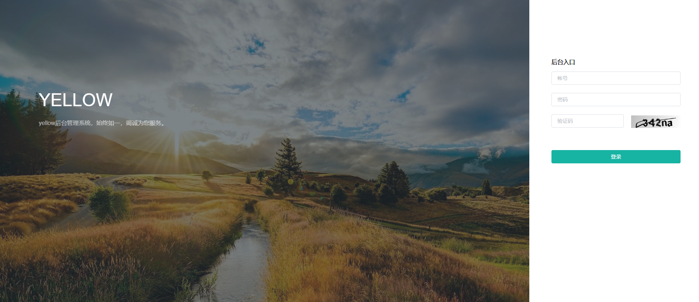

#### 用户管理模块
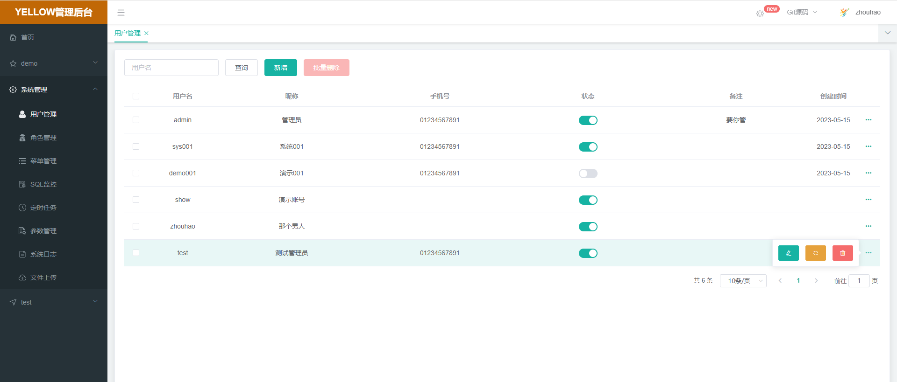
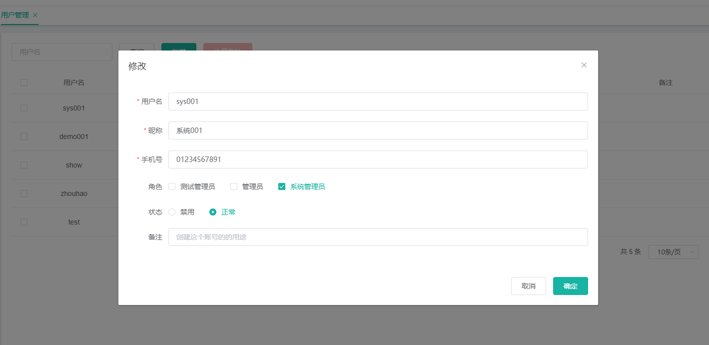

#### 角色管理模块
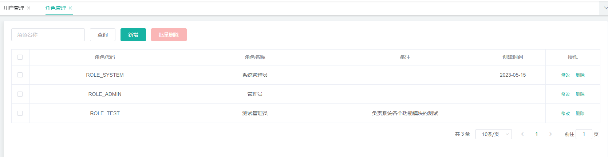
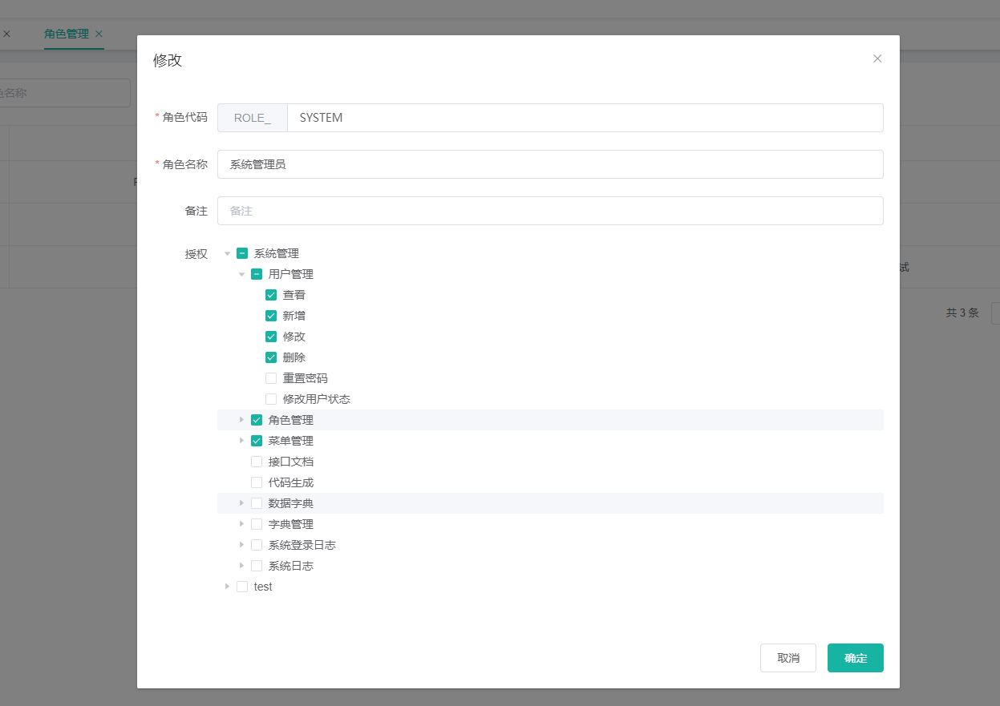

#### 菜单管理模块
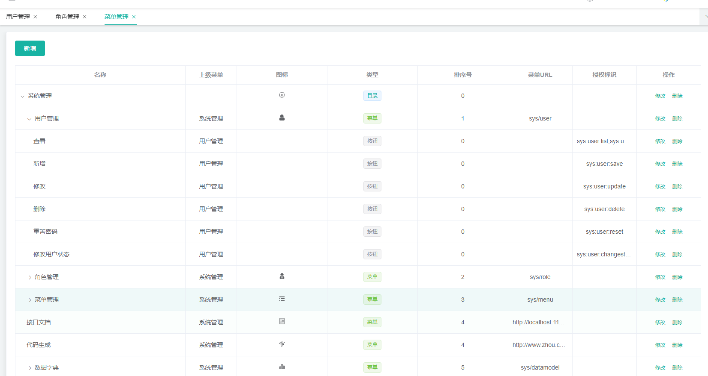
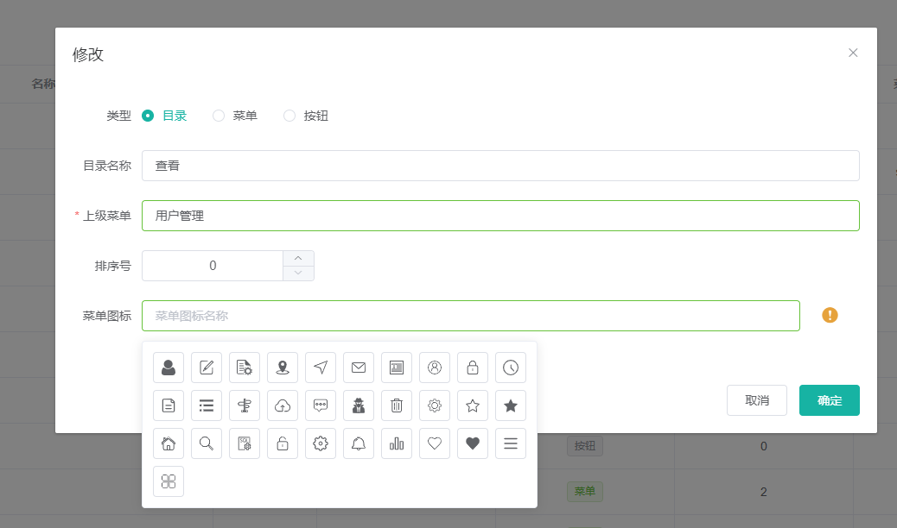
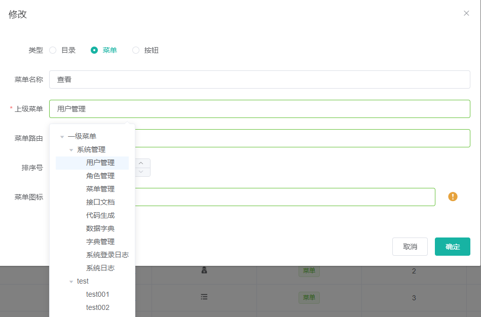
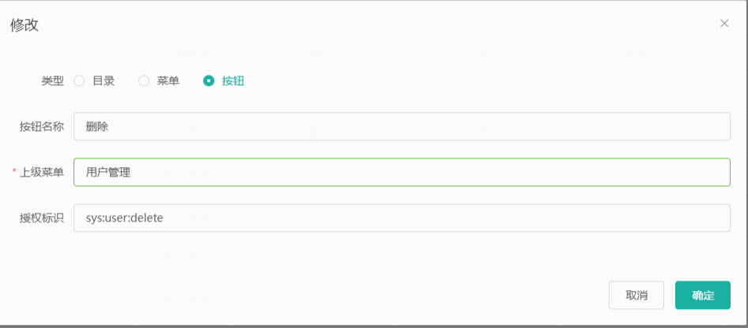

#### 接口文档
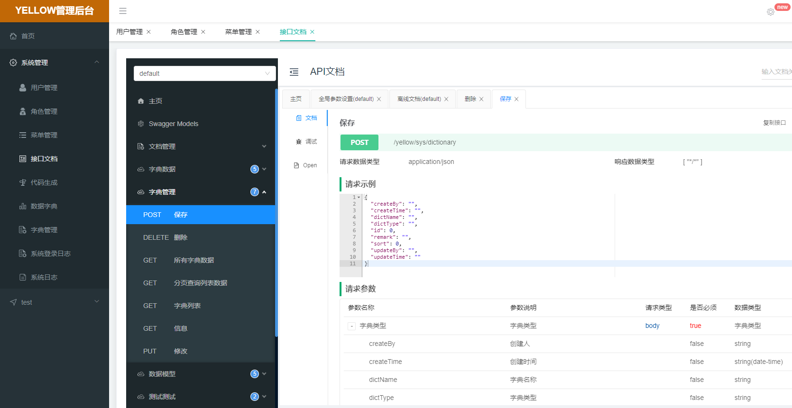

#### 代码生成
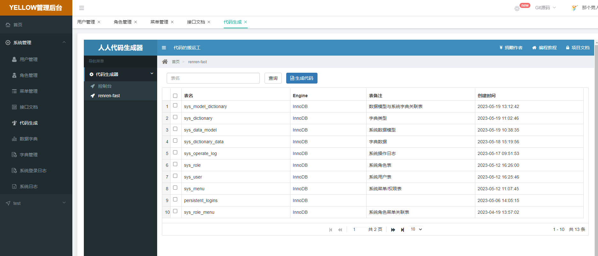

#### 数据字典
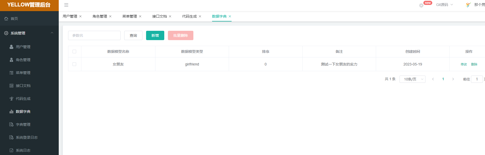
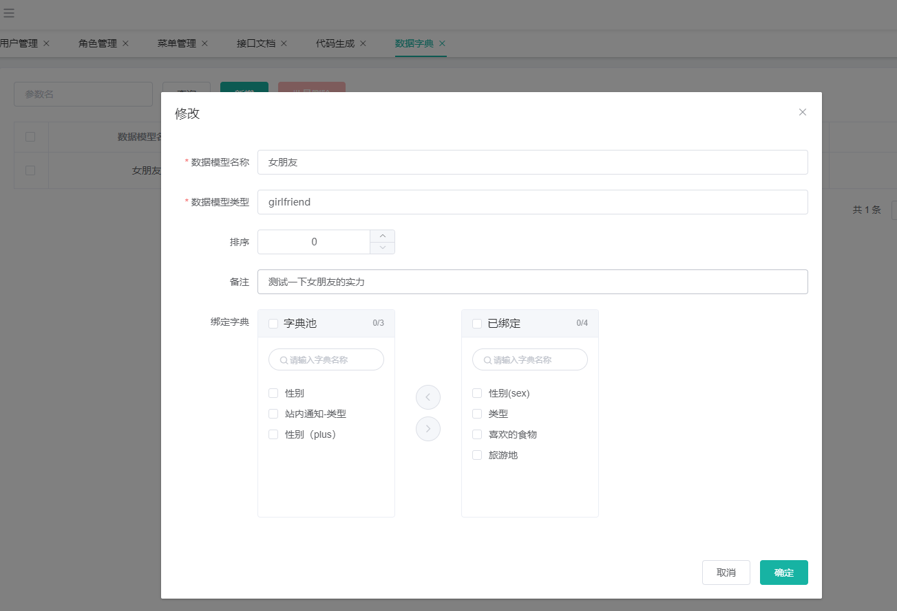

#### 字典管理
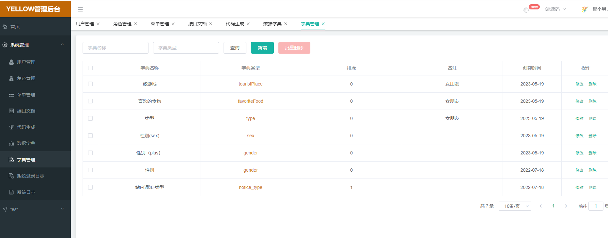
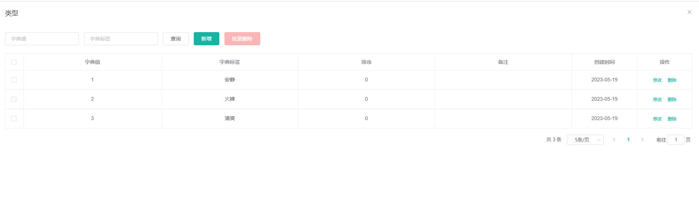

#### 登录日志

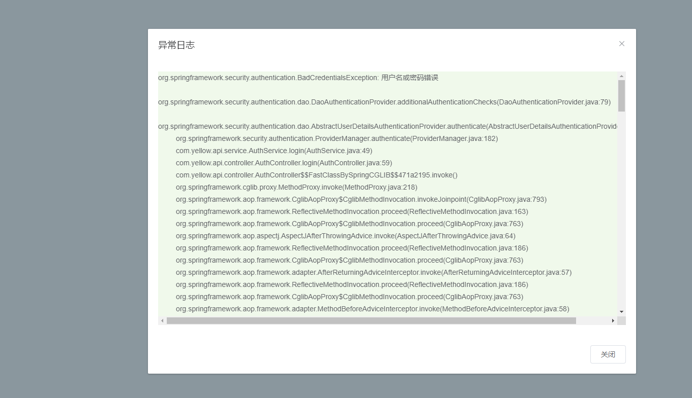

#### 操作日志
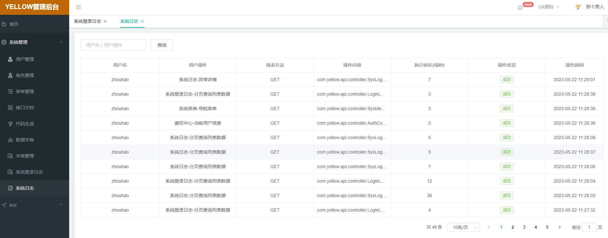
