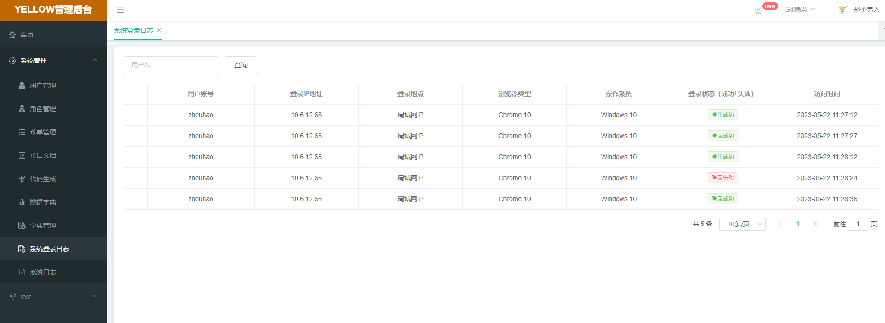

# yellow-web
- yellow-web基于[renren-fast-vue](https://gitee.com/renrenio/renren-fast-vue) 构建开发
- 前后端分离，通过token进行数据交互，可独立部署
- 主题定制，通过scss变量统一一站式定制
- 动态菜单，通过菜单管理统一管理访问路由
- 数据切换，通过mock配置对接口数据／mock模拟数据进行切换
- 发布时，可动态配置CDN静态资源／切换新旧版本

#### 登录模块

#### 用户管理模块

#### 角色管理模块

#### 菜单管理模块

#### 接口文档

#### 代码生成

#### 数据模型

#### 字典管理

#### 登录日志

#### 操作日志

#### 反馈交流
- QQ群：142713860

#### 版本更新说明
- v1.0：完成了基本的系统管理大模块，基于Spring Security的认证授权功能等；